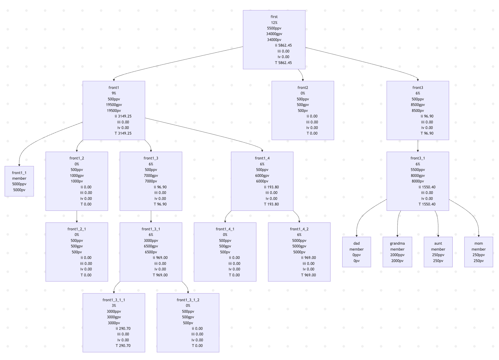

# Amway Business Plan Generator

Typescript code that can be use to generate/calculate Amway business orgainize<br>
Can be use as API  somewhere else to make a Amway-related orgainize/calculate program

- [ x ] Able to calculate the second, third and forth of business plans.
- [ x ] Support Mermaid program.
- [ x ] When generate flowchart via Mermaid, now can select how deep of layer to visual.
- [ x ] Support fifth of business plans
- [   ] Support for 6th-10th of business plans

> This script are based on Amway Thailand region
> 

## Prerequisites

This project requires NodeJS.
[Node](http://nodejs.org/) are really easy to install.
To make sure you have them available on your machine,
try running the following command.

```sh
$ node -v
v20.10.0
$ npm i
```

<!-- ## Table of contents

- [SpreadJSON](#SpreadJSON)
  - [Prerequisites](#prerequisites)
  - [Table of contents](#table-of-contents)
  - [Getting Started](#getting-started)
  - [Usage](#usage)
    - [Example](#example) -->

## Getting Started
```sh
$ npm run dev # by default, this wil copy mermaid code to a cilpboard
```

## Usage

<!-- [Caution]
<br>This script can only work for SheetJS's workbook that need to be in the format of JSON.
<br>You can use `XLSX.utils.sheet_to_json` function to convert your SpreadJS's workbook to JSON format and stored it as JSON file for this script to be able to read. -->

### Example

```ts
import { ABO } from "./internal";
import { flowchart } from "./mermaid-flowchart";

const first = new ABO(null, 'first').buy(5000);

const front1 = first.sponsor("front1");
    front1.member().buy(5000);
    const leader2 = front1.sponsor();
        leader2.sponsor();
    const leader3 = front1.sponsor();
        const leader4 = leader3.sponsor().buy(2500);
            leader4.sponsor().buy(2500);
            leader4.sponsor();
    const leader5 = front1.sponsor();
        leader5.sponsor();
        leader5.sponsor().buy(4500);

const front2 = first.sponsor("front2");

const front3 = first.sponsor("front3").sponsor().buy(5000);
    front3.member("dad");
    front3.member("grandma").buy(2000);
    front3.member("aunt").buy(250);
    front3.member("mom").buy(250);

console.log(flowchart(first));

```

So you can put Mermaid code to Mermand program to visualizing it as a flowchart


